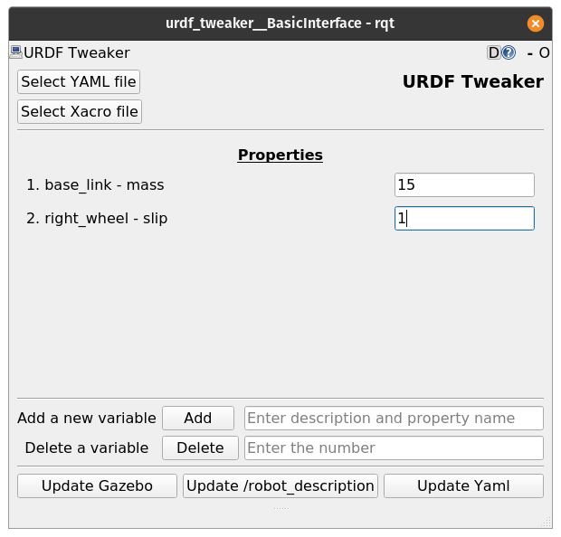

# Model Maker Helper

[The master branch is the version for ROS Kinetic, this branch is for ROS Noetic]

I always found the whole process of fine tuning the parameters of a URDF model very tedious, even using Xacro. So, after learning to create ROS plugins using Qt, I made this tool that can make the whole process much faster and easier. With this tool, you can create a list of properties and modify them, and then click a button and have the changes reflect in Rviz and Gazebo. 

To get the plugin, clone this repository into your catkin workspace and run `catkin_make`. 



While the tool makes the tuning process faster, it requires a little setup. Instructions for use:
1. Set up your URDf file to work with YAML files. Use [this.](http://wiki.ros.org/xacro#YAML_support)
2. Use Xacro variables for all the parameters you want to tune. 
3. Run `roscore` or make sure there's a ROS server running. 
4. Launch the plugin by using the command:
```
rqt --standalone urdf_tweaker
```
5. Select your URDF and YAML file.
6. Use 'Add' to add the parameters to the display. The format is 'text/property'. The text can be anything as long as the property is the same as the name used in your YAML and URDF file. 
7. Edit your values as you like and when you're done, press 'Update YAML file'.
8. Just for model making, aunch rviz by `rviz rviz`, and add a Robot Model display. 
9. Press 'Update /robot_description' to see your model. 
10. Whenever you change any of the values, press 'Update YAML file' and 'Update /robot_description', in that order, and you will see the model change in Rviz. 
11. The instructions are the pretty much the same for Gazebo, but you will have to use your own launch file for Gazebo. Tuning the parameters works the same way, just press the 'Update Gazebo' button. 
